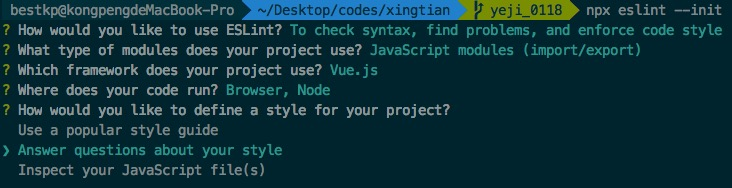
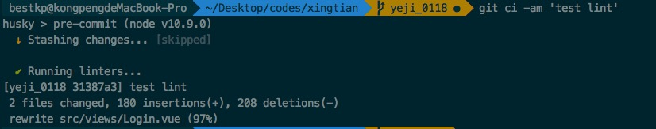

# vscode 中配置 eslint+prettier

##目录

- [一、vscode 插件安装](##一、vscode-插件安装)
- [二、vscode 配置](##二、vscode-配置)
- [三、增加 editorconfig 配置](##三、增加-editorconfig-配置)
- [四、项目配置](##四、项目配置)
- [五、代码提交前自动格式化](##五、代码提交前自动格式化)

## 一、vscode 插件安装

- [eslint](https://marketplace.visualstudio.com/items?itemName=dbaeumer.vscode-eslint 'eslint')： js 代码检查工具
- [prettier](https://marketplace.visualstudio.com/items?itemName=esbenp.prettier-vscode)： 代码格式化工具
- [editorconfig](https://marketplace.visualstudio.com/items?itemName=EditorConfig.EditorConfig)： 帮助开发人员在不同的编辑器和 IDE 之间定义和维护一致的编码样式
- [stylelint](https://marketplace.visualstudio.com/items?itemName=shinnn.stylelint)： CSS 代码检查工具

## 二、vscode 配置

`code -> 首选项 -> 设置 -> setting.json`添加如下配置：

```javascript
{
  // 使用2个空格缩进
  "editor.tabSize": 2,
  // js中使用单引号
  "prettier.singleQuote": true,
  // 配置打印宽度为120，超过120代码自动换行。
  "prettier.printWidth": 120,
  // 保存时自动修复（必选）
  "eslint.autoFixOnSave": true,
  // 添加对vue文件的检查
  "eslint.validate": [
    "javascript",
    "javascriptreact",
    {
      "autoFix": true,
      "language": "vue"
    }
  ],
  // 保存自动格式化（可选，如果不喜欢工具自动格式化，可以用手动使用快捷键格式化之后再手动保存）
  "editor.formatOnSave": true,
}
```

**对于 vue 项目安装[vetur](https://marketplace.visualstudio.com/items?itemName=octref.vetur)插件，为了避免冲突带来的困惑，请在 vscode 工具中添加如下配置：**

```json
"prettier.disableLanguages": [],
"vetur.format.defaultFormatter.html": "none",
"vetur.format.defaultFormatter.css": "none",
"vetur.format.defaultFormatter.postcss": "none",
"vetur.format.defaultFormatter.scss": "none",
"vetur.format.defaultFormatter.less": "none",
"vetur.format.defaultFormatter.stylus": "none",
"vetur.format.defaultFormatter.js": "none",
"vetur.format.defaultFormatter.ts": "none"
```

## 三、增加 editorconfig 配置

项目根目录创建`.editorconfig`文件，内容如下：

```javascript
# https://editorconfig.org
root = true

# 格式规范，请直接复制使用，勿修改。
[*]
charset = utf-8
end_of_line = lf
indent_size = 2
indent_style = space
insert_final_newline = true
max_line_length = 120
tab_width = 2
trim_trailing_whitespace = true
```

## 四、项目配置

#### 增加 npm 依赖

`eslint` `babel-eslint` `prettier` `eslint-config-prettier` `eslint-plugin-prettier`

```bash
  # 安装依赖
  npm i -D eslint babel-eslint eslint-config-prettier eslint-plugin-prettier prittier
```

#### 配置 prettier

项目根目录增加.prettierrc.js,内容如下：

```javascript
module.exports = {
	singleQuote: true,
	printWidth: 120,
	tabWidth: 2,
	semi: true
};
```

#### 配置 eslint

- **如果没有安装过 eslint**
  安装完成 eslint 后，执行`npx eslint --init`，会出现下里面界面：
  
  根据需要选择，最后会自动生成`.eslintrc.{js, json}`.
- **如果已经安装，则可以直接修改**

项目根目录增加.eslintrc.js,内容如下：

```javascript
# 注意此处用了vue的插件，需要安装 eslint-plugin-vue
module.exports = {
	root: true,
	parserOptions: {
		parser: 'babel-eslint'
	},
	env: {
		node: true,
		browser: true
	},
	extends: ['eslint:recommended', 'plugin:vue/essential', 'plugin:prettier/recommended'],
	plugins: ['vue'],
	rules: {
		'prettier/prettier': [
			'error',
			{
				singleQuote: true,
				printWidth: 120,
				tabWidth: 2,
				semi: true
			}
		],
		'no-console': 'off'
	}
};
```

# 五、代码提交前自动格式化

安装 npm 依赖

```bash
npm i -D husky lint-staged
```

**配置 lint-staged**
修改`package.json`配置

```js
## husky 可以使用git的钩子函数
## lint-staged 只会格式化暂存区的文件
{
  // ...
  "lint-staged": {
    "linters": {
      "src/**/*.{js,vue,jsx,ts,tsx,json,css,scss,md}": [
        "prettier --single-quote --semi --print-width 120 --tab-width 2 --write",
        "git add"
      ]
    },
    "ignore": ["src/**/*.min.js"]
  }
  // ...
}
```

**配置 husky**（应该是可以直接写在 package.json 里，但是不生效，未知原因）
增加.huskyrc, 内容如下：

```js
{
  "hooks": {
    "pre-commit": "lint-staged"
  }
}
```

这样执行 git commit 的时候就会去执行`lint-staged`配置的 prettier

